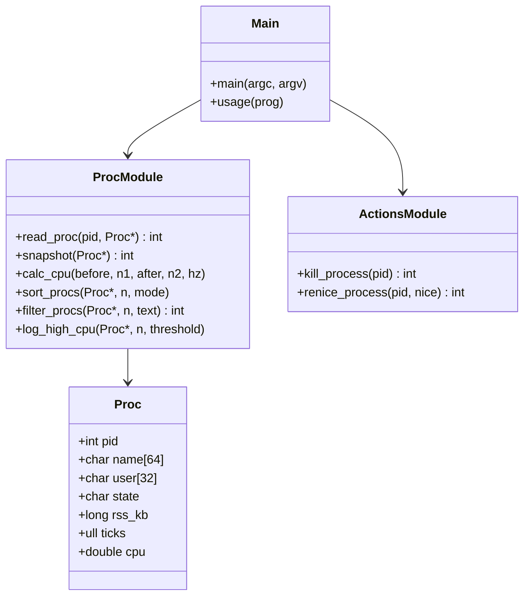
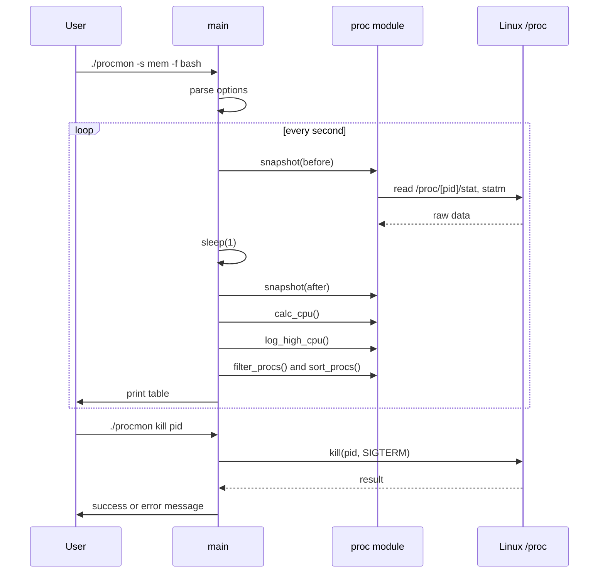
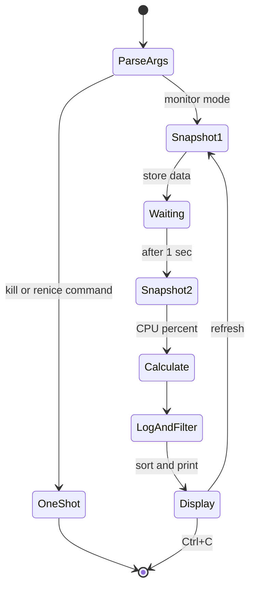

# Stage 3: System Design and Architecture

## 1. Architecture
```
+--------------------------------------------+
|                 main.c (UI)                |
|   display loop | arguments | options       |
+---------------------+----------------------+
                      |
              +-------v--------+
              |     proc.c     |
              | snapshot, CPU%, |
              | sort, filter,   |
              | kill, renice,   |
              | logging         |
              +-------+--------+
                      |
       +--------------v---------------+
       |  Linux kernel: /proc, syscalls |
       +------------------------------+
```

## 2. Components and Responsibilities
| Component | Responsibility |
|-----------|----------------|
| main.c | Parse arguments, run refresh loop, print table |
| proc.c | Read /proc, compute CPU %, sort, filter, kill, renice, log |
| proc.h | Proc structure and function declarations |
| Linux kernel | Provides /proc data and system calls |

## 3. Data Structure
```c
typedef struct {
    int pid;
    char name[64];
    char user[32];
    char state;
    long rss_kb;
    unsigned long long ticks;   /* utime + stime */
    double cpu;                 /* percent */
} Proc;
```
Two static arrays, `before[MAX]` and `after[MAX]` (MAX = 4096), hold the two snapshots.

## 4. Class Diagram
C has no classes, so each module is shown as a class.


## 5. Sequence Diagram


## 6. State Machine Diagram


## 7. Implementation Plan
1. proc.h with the Proc struct and declarations
2. read_proc() and snapshot()
3. calc_cpu() and display in main.c
4. kill_process()
5. sort_procs(), filter_procs(), command-line options
6. renice_process(), user column, log_high_cpu()
7. Unit tests and Makefile

## 8. Environment and Tools
| Tool | Purpose |
|------|---------|
| Ubuntu on WSL2 | Linux environment |
| VS Code | Editor |
| gcc, make | Build |
| Git, GitHub | Version control |
| Mermaid | UML diagrams |

## 9. Git Strategy
- Branches: `main` (stable), `dev` (integration), `feature/cpu-calc`, `feature/sort-filter`, `feature/actions`, `feature/logging`
- Commit prefixes: `feat:`, `fix:`, `docs:`, `test:`
- Merge feature branches into `dev`, then `dev` into `main` at the end of each stage; tag releases (`v0.1`, `v1.0`)

## Next Stage
Stage 4: implement core modules and demonstrate the prototype.