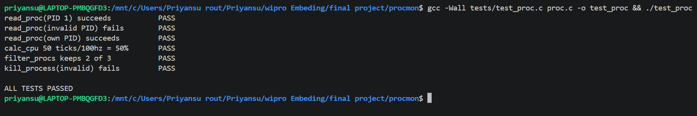
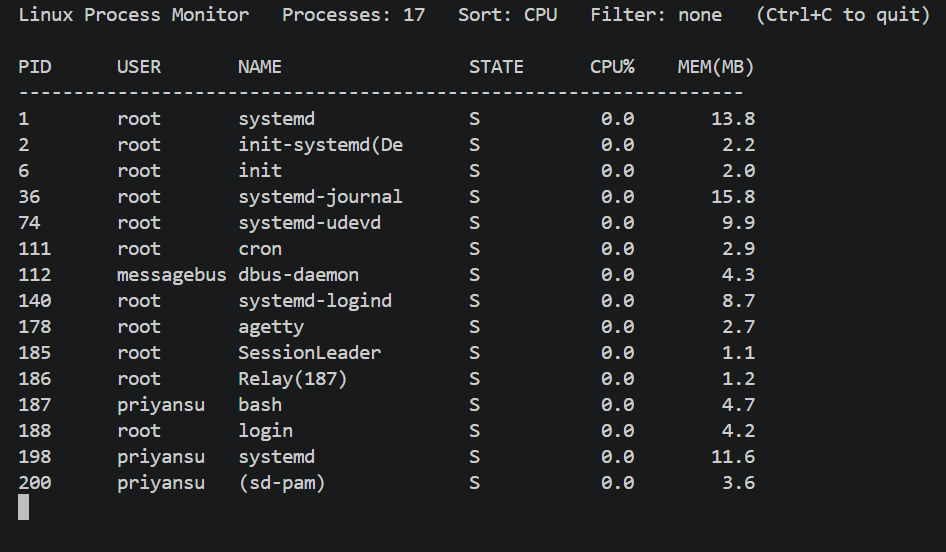

# Stage 5: Test Report

## Unit Tests
Run: `gcc -Wall tests/test_proc.c proc.c -o test_proc && ./test_proc`

| ID | Test | Expected | Actual | Result |
|----|------|----------|--------|--------|
| U1 | read_proc(PID 1) | Returns 1 | Returns 1 | Pass |
| U2 | read_proc(invalid PID) | Returns 0 | Returns 0 | Pass |
| U3 | read_proc(own PID) | Returns 1 | Returns 1 | Pass |
| U4 | calc_cpu (100 to 150 ticks, hz 100) | About 50% | About 50% | Pass |
| U5 | filter_procs("bash") on 3 entries | Keeps 2 | Keeps 2 | Pass |
| U6 | kill_process(invalid PID) | Returns -1 | Returns -1 | Pass |

## Integration Tests
| ID | Test | Expected | Actual | Result |
|----|------|----------|--------|--------|
| I1 | Run `yes > /dev/null &`, start procmon | yes at top, about 100% CPU | | |
| I2 | `./procmon -s mem` | Sorted by memory | | |
| I3 | `./procmon -f bash -n 5` | Only bash entries, max 5 rows | | |
| I4 | CPU above 50% | Line added to procmon.log | | |

## System Tests
| ID | Test | Expected | Actual | Result |
|----|------|----------|--------|--------|
| S1 | Run 10 minutes while starting and stopping processes | No crash | | |
| S2 | `./procmon renice <pid> 10` | Nice value changes (check with `ps -o ni -p <pid>`) | | |
| S3 | `./procmon renice <pid> -5` without sudo | Permission error, no crash | | |

## Negative Tests
| ID | Test | Expected | Actual | Result |
|----|------|----------|--------|--------|
| N1 | `./procmon kill 99999999` | Error message | | |
| N2 | `./procmon -x` | Usage message | | |

## Defects Found and Fixed
| Defect | Cause | Fix |
|--------|-------|-----|
| False test failure | CHECK macro used its argument twice | Evaluate once into a local variable |
| gcc format warning | `%*ld` in fscanf | Use `%*d` |

## Evidence

